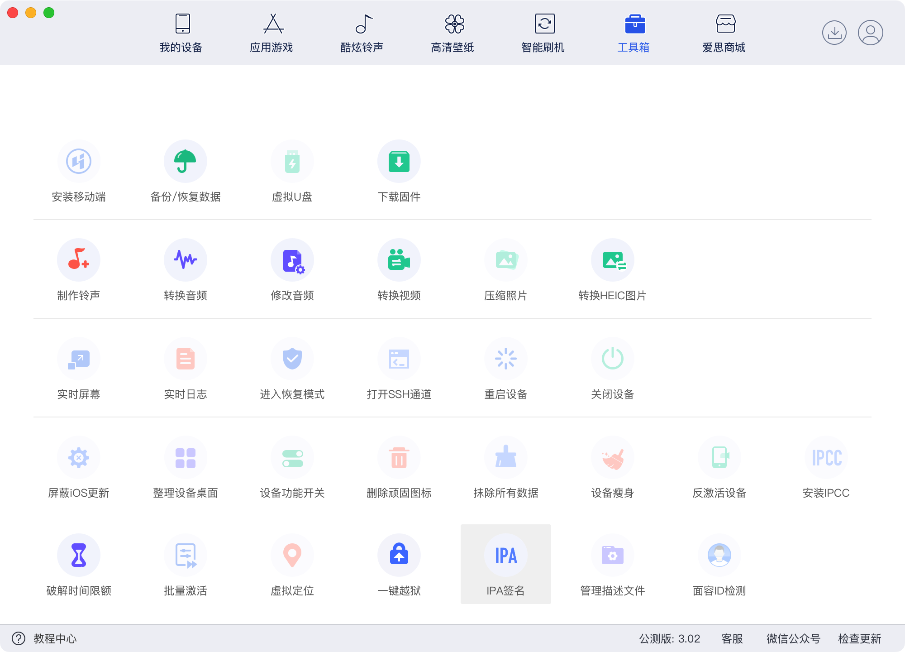
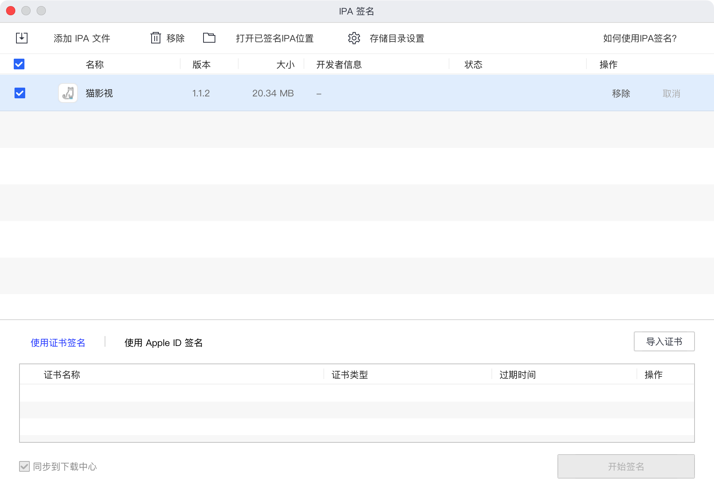
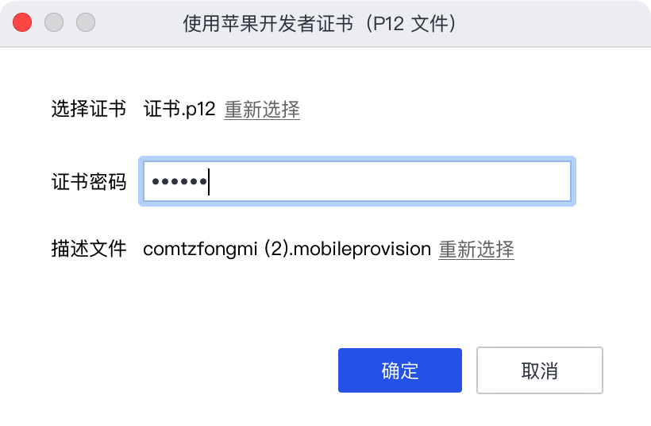

<!-- more -->

# IOS安装IPA的方法

首先从网络上下载的ipa是不带签名的，需要我们自行对ipa进行签名。

爱思助手提供了方便的签名工具：

​​​​

选择IPA文件添加进去

​​

为了不7天就安装一次，所以需要手动导入证书，（这个证书需要开通个人或者企业开发者）

制作证书需要登录[https://developer.apple.com/](https://developer.apple.com/)

点击Certificates创建一份证书，下载一份cer文件，保存到本地转换为p12文件

创建完证书之后到Devices中将自己设备的UUID写进去

到Identifiers中创建Bundle ID啥的

制作Profiles描述文件，将上面创建的证书，UUID设备，Bundle ID 一股脑都塞进去，最后下载出来一份mobileprovision格式的文件

‍

​​

全选进去进行签名。

‍

签名之后的ipa文件，命名成xxx@Bundle ID.ipa ，拖动到alist进行安装，或者爱思助手进行安装，还可以airdrop推到手机进行安装
