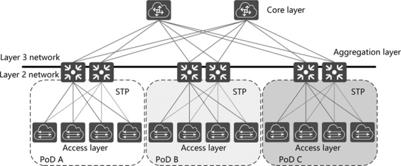
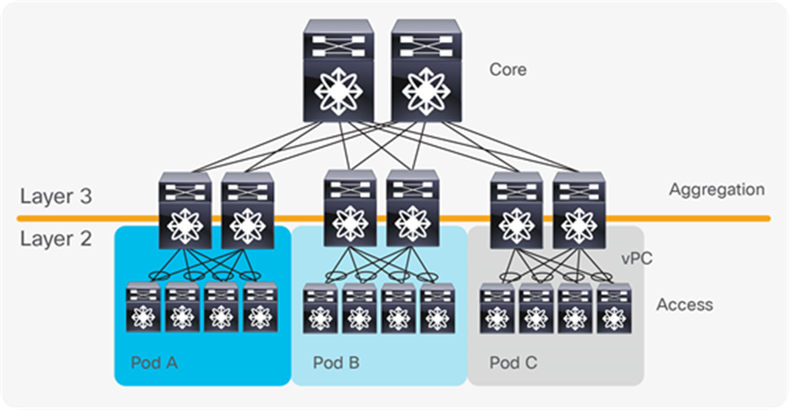
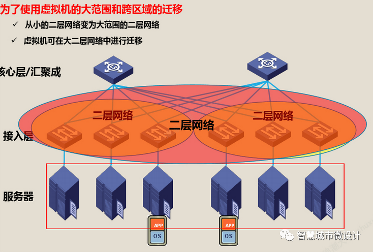
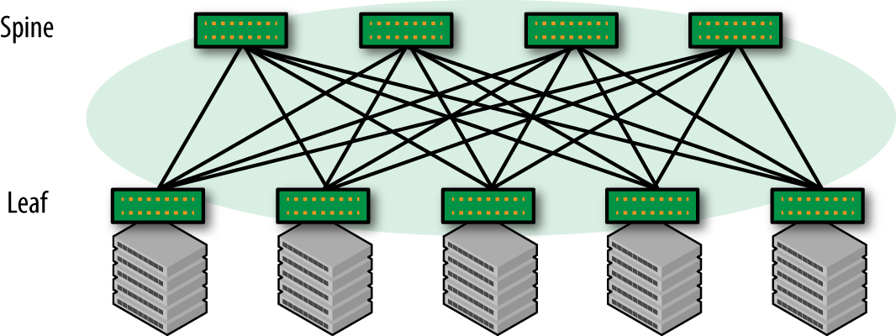
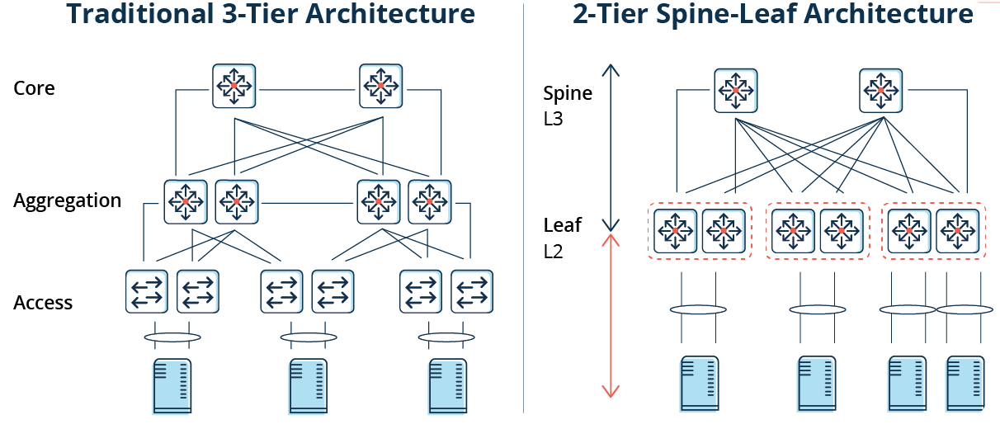

# Spine-Leaf架构

在阅读[6.824](https://pdos.csail.mit.edu/6.824/schedule.html)的时候，里面提到Map Reduce底层的存储GFS是采用网络进行通信，由于当年Google提出MapReduce的时候还依赖于传统三层架构，没有办法承载巨大的南北流量，所以需要将Map Reduce的Work尽可能的和GFS部署到一起，以免造成网络的拥塞。

现如今随着时代发展，新的网络架构Spine-Leaf能够很好的承载南北流量。

‍

在传统的大型数据中心，采用了层次化模型设计的三层网络。将复杂的网络设计分成几个层次，每个层次着重于某些特定的功能，这样就能够使一个复杂的大问题变成许多简单的小问题。三层网络架构设计的网络有三个层次：

​​

* **核心层（网络的高速交换主干）**  
  核心层在互联网中承载着网络服务器与各应用端口间的传输功能，是整个网络的支撑脊梁和数据传输通道。核心交换机为进出数据中心的包提供高速的转发，为多个汇聚层提供连接性，核心交换机通常为整个网络提供一个弹性的L3路由网络
* **汇聚层（提供基于策略的连接）**  
  汇聚层连接网络的核心层和各个接入的应用层，在两层之间承担“媒介传输”的作用。在应用接入核心层之前先经过汇聚层进行数据处理，以减轻核心层设备的负荷。汇聚层提供内容交换、防火墙、SSL卸载、入侵检测、网络分析等服务。
* **接入层（将工作站接入网络）**  
  接入层的面向对象主要是终端客户，为终端客户提供接入功能，接入层的主要功能是规划同一网段中的工作站个数，提高各接入终端的带宽。

​​

通常情况下，汇聚交换机是L2和L3网络的边界，汇聚交换机以下的是L2网络，以上是L3网络。每组汇聚交换机管理一个POD，每个POD内都是独立的VLAN网络。当服务器在一个POD内迁移时，不必修改IP地址和默认网关，因为一个POD对应一个二层广播域。

‍

在汇聚路由器和接入交换机之间，使用生成树协议（STP）构建二层网络的无环路拓扑。

生成树协议有几个优点：它很简单，是一种只需要很少配置的即插即用技术。但是，生成树协议不能使用并行转发路径，往往会阻塞 VLAN 中的冗余路径。

2010年，思科引入vPC（Virtual Port Channel）技术，消除了生成树阻塞端口，提供从接入交换机到汇聚路由器的双活上行链路，充分利用可用带宽。但vPC也不能真正做到完全的水平扩展。

​​

## 传统三层数据中心网络挑战

三层网络架构因其实现简单、配置工作量小、广播控制能力强等优点，被广泛应用于传统 DCN。但随着数据中心整合、虚拟化、云计算等技术的发展，传统三层网络架构已经无法满足网络的需求，主要原因有：

1. 无法支撑虚拟机迁移所需的大二层网络构建
2. 无法支持流量的无阻塞转发（尤其是东西向流量）

**虚拟机动态迁移**

虚拟化技术从根本上改变了数据中心网络架构的需求。通过服务器虚拟化可以有效地提供服务器利用率，按需提供服务和资源，降低能源消耗，降低客户的运维成本，所以得到了广泛的应用。

在虚拟化数据中心里，一台物理服务器被虚拟化为多台逻辑服务器，称为VM，每台VM都可以独立运行，有自己的OS，APP，也有自己独立的MAC地址和IP地址。

虚拟化出来以后，就产生了虚拟机动态迁移的需求，虚拟机动态迁移是指在保证虚拟正常运行的同时，将一个虚拟机从一台物理服务器移动到另一台物理服务器的过程。该过程对于最终用户来说是无感知的，所以要保证在迁移过程中，虚拟机的业务不能中断。

虚拟机在动态迁移时，不仅要求虚拟机的IP地址不变、而且运行状态也必须保持（例如TCP会话状态），这就需要迁移的起始和目标位置必须在同一个二层网络域之中。

由于限制，传统数据中心的三层网络架构设计根本无法满足服务器虚拟化中更灵活的、可自定义的虚拟机迁移策略。

‍

为了实现虚拟机的大范围，甚至跨地域的动态迁移，就要求把虚拟机迁移可能涉及的所有服务器都纳用同一个二层网络域，通过虚拟化的技术形成一个更大范围的二层网络。这样才能实现虚拟机的大范围无障碍迁移，这种适合虚拟机随时随地无障碍迁移的大范围二层网络，我们称之为大二层网络。

​​

**数据中心的流量的转变**

数据中心的流量总的来说可以分为以下几种：

* 南北向流量：数据中心之外的客户端到数据中心服务器之间的流量，或者数据中心服务器访问互联网的流量。
* 东西向流量：数据中心内的服务器之间的流量。
* 跨数据中心流量：不同数据中心的流量，例如数据中心之间的灾备，私有云和公有云之间的通讯。

在传统数据中心中，业务通常采用专线方式部署。通常，服务部署在一个或多个物理服务器上，并与其他系统物理隔离。因此，传统数据中心东西向流量较低，南北向流量约占数据中心总流量的80%。

在云数据中心，服务架构逐渐从单体架构转变为Web-APP-DB，分布式技术成为企业应用的主流。服务的组件通常分布在多个虚拟机或容器中。该服务不再由一台或多台物理服务器运行，而是由多台服务器协同工作，导致东西向流量快速增长。

此外，大数据服务的出现使分布式计算成为云数据中心的标准配置。大数据服务可以分布在一个数据中心的数百台服务器上进行并行计算，这也大大增加了东西向流量。

传统的三层网络架构是为南北向流量占主导地位的传统数据中心设计的，不适合东西向流量较大的云数据中心。

一些东西向流量（如跨POD的二层和三层流量）必须经过汇聚层和核心层的设备转发，不必要地经过许多节点。传统网络通常设置1:10到1:3的带宽超额比，以提高设备利用率。随着超额订阅率，每次流量通过节点时性能都会显着下降。此外，第 3 层网络上的 xSTP 技术加剧了这种恶化。

因此，如果通过传统三层网络架构运行大量的东西向流量，连接到同一交换机端口的设备可能会争夺带宽，导致最终用户获得的响应时间很差。

## Spine-Leaf架构

Clos 网络以其发明者Charles Clos命名，Charles Clos是一名电话网络工程师，他在 1950 年代需要解决如何应对电话网络的爆炸式增长这一问题. 提出了现在称之为 Clos 的网络架构。

​​

Spine-Leaf体系架构是由Spine和Leaf这两个交换层组成的数据中心网络拓扑结构。Leaf层由访问交换机组成，汇聚来自服务器的流量，并直接连接到Spine或网络核心。Spine交换机在全网格拓扑中互连所有Leaf交换机。上图中，绿色节点代表交换机，灰色节点代表服务器。在绿色节点中，最上面的是Spine节点，下面是Leaf节点。

Spine-Leaf架构更适合满足现代应用程序的需求，例如高吞吐量和低延迟。

Spine交换机具有高吞吐量、低延迟且端口密集，它们与每个Leaf交换机都有直接的高速 (40-400Gbps) 连接。

Leaf交换机与传统TOR交换机非常相似，它们通常是 24 或 48 端口 1、10 或 40Gbps的接入层连接。但是，它们增加了到每个Spine交换机的 40、100 或 400Gbps 上行链路的能力。

**Spine-Leaf架构与传统网络设计有何不同？**

传统数据中心的网络通常基于三层模型：

* 接入交换机连接到服务器
* 汇聚交换机为接入交换机提供冗余连接
* 核心交换机在汇聚交换机之间提供快速传输

Spine-Leaf 架构减少了核心层，实现了层次的扁平化，如下图所示。

​​

此外，关于Spine-Leaf 架构的其他常见差异如下：

放弃了[生成树协议 (STP)](#生成树协议)
* 越来越多地使用固定端口交换机而不是网络骨干的模块化模型
* 横向与纵向基础架构的扩展

上文有提到如今东西向流量越来越多，低延迟、优化流量对于东西向流量的性能至关重要，尤其是在时间敏感或数据密集型应用程序中。Spine-Leaf架构的主要好处之一就是它允许数据流从数据的源到数据的目标路径较短。无论源和目的地如何，Spine-Leaf结构中的数据流在网络上的跳数都相同，任意两个服务器之间都是Leaf—>Spine—>Leaf三跳可达的。

由于Spine-Leaf 架构不再需要 STP，容量也得到了提高。其依赖诸如 ECMP（等价多路径）路由等协议来平衡所有可用路径上的流量，同时仍然避免网络环路。

除了更高的性能外，Spine-Leaf 架构还提供了更好的可扩展性。可以添加额外的Spine交换机并将其连接到每个Leaf ，从而进一步增加容量。同样，当端口密度成为问题时，可以无缝添加新的Leaf 交换机。在这两种情况下，网络都不必为基础设施的这种扩展（“横向扩展”）而重新设计，也没有停机时间。

## 总结

Spine-leaf架构和传统架构是两种不同的网络架构。下面是它们之间的一些比较：

1. 扁平性：传统架构通常是三层架构，包括核心层、汇聚层和接入层。而Spine-leaf架构是一种扁平化架构，没有分层，所有的交换机都连接到Spine交换机上。这种扁平化的架构可以提高网络性能和可伸缩性。
2. 带宽：传统架构通常需要跨越多个层次的交换机才能到达目的地，因此需要更多的带宽来支持这些交换机之间的通信。而Spine-leaf架构中，所有的交换机都直接连接到Spine交换机上，因此需要的带宽更少。
3. 适用范围：传统架构适用于较小的网络，而Spine-leaf架构适用于大型数据中心和云计算环境。
4. 灵活性：Spine-leaf架构比传统架构更灵活，因为所有的交换机都可以直接连接到Spine交换机上，可以根据需要轻松添加或删除交换机。
5. 可靠性：Spine-leaf架构中，每个交换机都有多个路径到达目的地，因此可以提供更高的可靠性和冗余性。

总体来说，Spine-leaf架构比传统架构更适合大型数据中心和云计算环境，因为它可以提供更好的性能、可伸缩性和可靠性。

‍

‍

### 生成树协议

生成树协议（Spanning Tree Protocol, STP）是一种用于防止网络中的环路的协议。当网络中存在多个路径时，可能会出现环路，导致数据在网络中循环转发，最终导致网络拥塞和性能下降。生成树协议可以在网络中选择一条路径作为主路径，而其他的路径则被阻塞，从而避免环路的出现。

生成树协议的基本思想是，将网络中的交换机按照一定的规则组成一棵树，使得网络中不存在环路。协议会选择一台交换机作为根交换机，然后通过交换机之间的BPDU（Bridge Protocol Data Unit）交换协商出每个交换机的角色（根、边缘、汇聚）以及相应的端口状态（开放、阻塞、转发），最终得到一棵树形拓扑结构。

当网络中某个连接发生故障时，生成树协议会重新计算路径，选择一条新的路径作为主路径，从而保证网络的连通性和稳定性。

生成树协议是一种成熟的网络协议，广泛应用于以太网等局域网技术中。除了STP，还有RSTP、MSTP等变种协议，用于提供更高效、更灵活的网络环路防护机制。

‍
