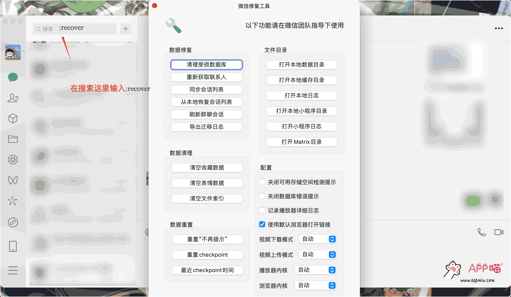

# macOS的微信打开修复工具设置默认浏览器打开

微信mac新版，点击链接默认是使用微信内置的浏览器打开，体验非常差。

如果你想继续使用系统默认浏览器打开链接，可以试试下面3个方法：

1. 鼠标放到链接处，右键，然后选择「使用默认浏览器打开」
2. 按住Command键，点击链接
3. 在微信搜索框输入“#:recover#​”，会弹出一个设置页面（微信修复工具），勾上「使用默认浏览器打开链接」。

以上方法对微信已经显示出网页标题卡片内容的链接无效。操作没有以前直接点击就用默认浏览器打开那么好，但是也还能勉强能用。微信真是想尽办法让用户留在微信内。

除了可以设置默认浏览器，还能清空数据，打开本地数据迷路管理一下微信。

## 截图演示

​​

## 代码指令

```sql
:recover
```
