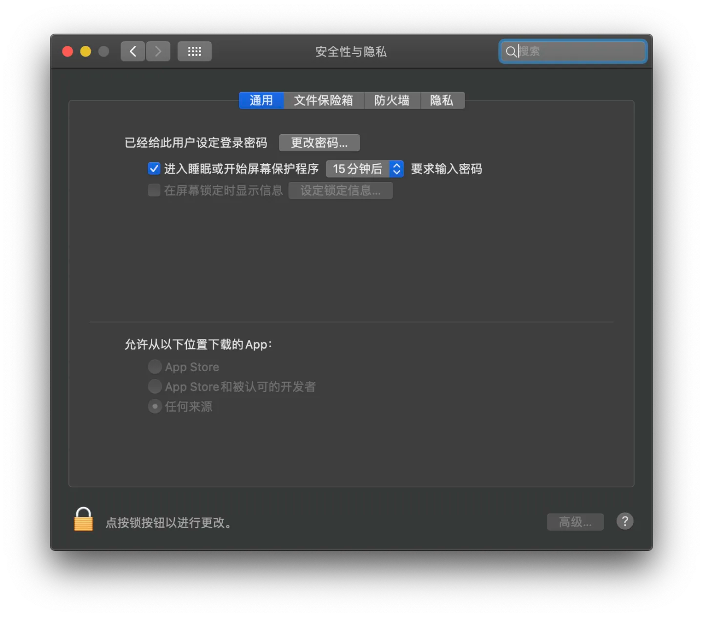

# 解决Mac安装软件的已损坏，无法打开

# **允许“任何来源”开启**

苹果从macOS Sierra 10.12 开始，已经**去除了允许“任何来源”的选项**，如果不开启“任何来源”的选项，会直接影响到无法运行的第三方应用。

所以开启“任何来源”的方法如下：

打开【启动台】，选择【终端】，输入：

```text
sudo spctl  --master-disable
```

然后回车，继续输入密码（密码输入时是不可见的），然后回车。

接着打开【系统偏好设置】，选择【安全性与隐私】，选择【通用】，可以看到【任何来源】已经选定。

​​接着打开文件进行安装。

# **发现还是显示“已损坏，无法打开。 ​**

**需要移除应用的安全隔离属性。**

打开 “终端” 执行如下命令（根据提示输入您的密码即可）：

​`sudo xattr -dr com.apple.quarantine /Applications/name.app`​

​`/Applications/name.app`​ 如果不知道该如何输入，将 App 直接拖拽 `sudo xattr -rd com.apple.quarantine`​（中间有个空格）后面即可。

一般情况下，多余的扩展属性都可以清除（个别应用例外）：

可以直接输入：`sudo xattr -cr /Applications/*`​

# macOS Ventura 额外步骤

macOS Ventura 的系统安全性又上升到一个新的高度，上述两个步骤后，需要在 “系统设置” 中打开应用。

系统设置 – 隐私和安全性，“安全性” 下面出现提示，点击 “仍要打开”，当然该操作仅需要一次，以后可以正常打开。

# 重新签名

多数情况下，App 已经可以正常运行了，很多和谐软件因为证书问题，仍然无法打开。此时可以重新签名。

打开 “终端”，执行如下命令：

​`codesign --force --deep --sign - /Applications/name.app`​

**前提条件**: 安装 Command Line Tools for Xcode

此时会提示安装，或者使用终端命令在线安装：

​`xcode-select --install`​

‍
